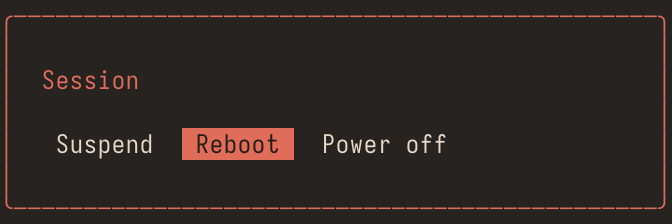
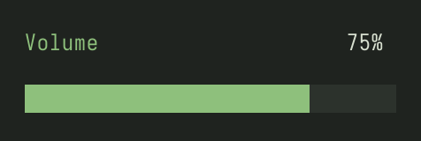
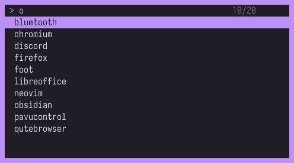
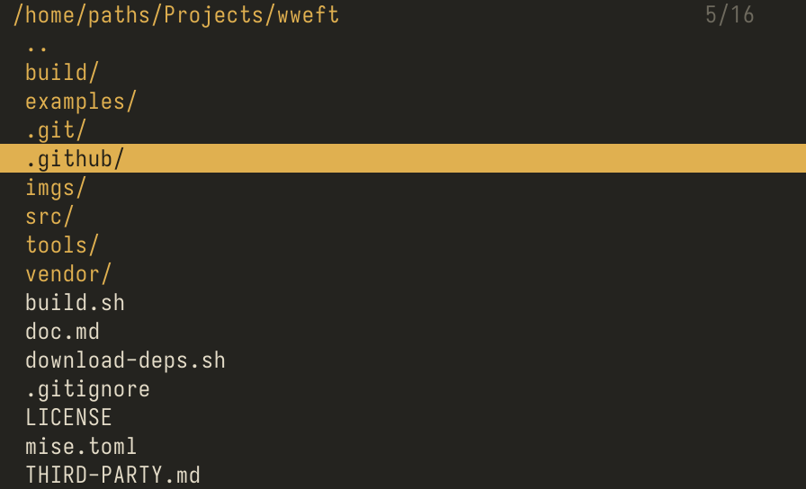

# wweft

A scriptable OSD for Wayland. Wren in, cells out.

 
 


wweft puts a grid of text cells on a `wlr-layer-shell` surface and gives a
Wren script the content. One binary, 150 KB, no toolkit. A menu, a bar,
a volume popup, and a file browser are wren scripts.

## Build

```sh
./download-deps.sh     # system packages, Wren, stb_truetype, the fallback font
./build.sh             # build/wweft
```

Arch and Debian are handled. Anything else needs `wayland`,
`wayland-protocols`, and `libxkbcommon` installed first.

## Run

```sh
wweft examples/session.wren
ls ~/Projects | wweft examples/dmenu.wren
```

```ini
# hypr/bindings.conf
bind = SUPER, ESCAPE, exec, wweft ~/.config/wweft/session.wren
```

The choice goes to stdout. Exit code 0 means chosen, 1 means cancelled.

## API

Tagged in source:

```sh
grep -o '@api.*' src/script_wren.c | sort
```

Key names come from xkbcommon: `a`, `A`, `Left`, `Ctrl+Left`, `Escape`.

`import "theme" for Theme` searches the script directory, then
`$XDG_CONFIG_HOME/wweft`, then `~/.config/wweft`. Config is Wren.

## Examples

| File | What |
|---|---|
| `examples/session.wren` | power menu, `spawn` runs the choice |
| `examples/volume.wren` | PipeWire volume through `wpctl` |
| `examples/dmenu.wren` | items on stdin, type to filter |
| `examples/browser.wren` | file navigator, read only |
| `examples/bar.wren` | a bar: workspaces, a clock, no keyboard |
| `examples/hypr.wren` | Hyprland state for `bar.wren`, imported by name |
| `examples/notify.wren` | one notification, one process, ends itself |

The palette is four numbers at the top of each script.

## Environment

| Name | Effect |
|---|---|
| `WWEFT_FONT` | path of a TTF file |
| `WWEFT_SIZE` | cell height in pixels, default 16 |
| `WWEFT_DEBUG` | key names to stderr |
| `WWEFT_DUMP` | write each frame to a file, as a PAM image |
| `WWEFT_NO_FRACTIONAL` | fall back to whole number scaling |

## License

MIT. It carries Wren, stb_truetype, and the Spleen font.
`wweft --license` prints every notice.
